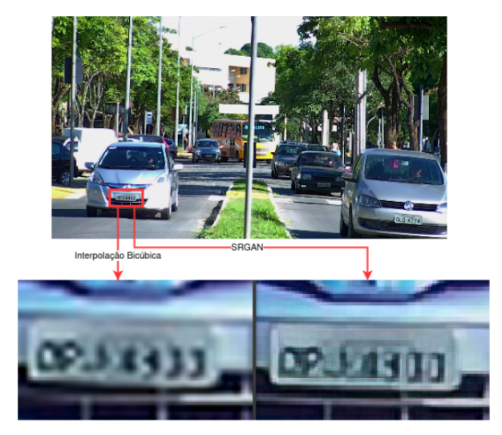

## Super Resolução em Sistemas de Videovigilância: Um Estudo Comparativo 

### Introdução
Este repositório apresenta um estudo comparativo de técnicas de superresolução aplicadas à aprimoramento de imagens de baixa resolução capturadas por câmeras de segurança, com foco na identificação de caracteres de placas de veículos. O objetivo principal é avaliar o desempenho de diferentes métodos sob a ótica da qualidade da imagem e da precisão no reconhecimento de caracteres.

### Metodologia
O estudo foi conduzido utilizando um conjunto de dados personalizado, o Sense ALPR, composto por imagens de placas de veículos reais obtidas de câmeras de segurança. As técnicas de superresolução empregadas foram:

- **Interpolação bicúbica:** Uma técnica tradicional de interpolação de imagens que utiliza polinômios cúbicos para estimar os valores de pixels ausentes.
-   **SRGAN:** Uma rede generativa adversária baseada em residual para superresolução de imagens.
-   **ESRGAN:** Uma versão aprimorada do SRGAN que incorpora mecanismos de atenção e módulos de reescalonamento subpixelais.

Para avaliar o desempenho das técnicas, foram utilizados os seguintes critérios:

-   **Qualidade da imagem:** Métricas como PSNR e SSIM foram utilizadas para quantificar a fidelidade da imagem super-resoluída à imagem original.
-   **Precisão no reconhecimento de caracteres:** A taxa de reconhecimento de caracteres (OCR) foi utilizada para avaliar a capacidade das técnicas de superresolução de preservar a legibilidade dos caracteres nas placas de veículos.

### Resultados
| Conjunto de imagens           | Qtd. de distâncias < 5 | Qtd. de distâncias < 4 | Qtd. de distâncias < 3 | Qtd. de distâncias < 2 |
|-------------------------------|------------------------|------------------------|------------------------|------------------------|
| Original                      | 31                     | 19                     | 8                      | 4                      |
| Interpolação Bicúbica         | 196                    | 122                    | 66                     | 27                     |
| SRGAN                         | 231                    | 137                    | 73                     | 30                     |
| ESRGAN                        | 203                    | 126                    | 60                     | 28                     |

A tabela acima foi construída a partir dos resultados produzidos pelo cálculo da distância de Levenshtein sobre o resultado do OCR de cada imagem dos conjuntos produzidos por cada uma das técnicas mais o conjunto de teste sem nenhum processo de superresolução. Nas colunas, estão registrados os valores que representam a quantidade de distâncias de Levenshtein, para cada técnica, que foram menores que o valor indicado. Através da análise dos valores da tabela, podemos concluir que os melhores resultados são do método SRGAN, seguido dos resultados do método ESRGAN,  como era esperado.

### Figuras

### Conclusão
O estudo das técnicas de superresolução de imagens digitais teve intensa atividade nos ultimos cinco anos e, no momento da escrita deste artigo, é possível que existam formas mais poderosas para a solução do problema de identificação de elementos, não facilmente visíveis em sistemas de videovigilância, de forma automática. O objetivo de descobrir se as técnicas que foram analisadas auxiliavam na solução do problema proposto foi atingido, e foi obtida uma resposta positiva.

### Recursos
-   **Conjunto de dados Sense ALPR:**  [https://paperswithcode.com/dataset/ufpr-alpr](https://paperswithcode.com/dataset/ufpr-alpr)
-   **Biblioteca ISR:**  [https://github.com/idealo/image-super-resolution](https://github.com/idealo/image-super-resolution)**
-   **Artigo:**  [PDF](https://drive.google.com/file/d/1F1pbUR2B6skvhTUeTmLjTdU584QIvUrd/view)

### Contribuições
-   Implementação das técnicas de superresolução SRGAN e ESRGAN.
-   Avaliação do desempenho das técnicas de superresolução em um conjunto de dados real de imagens de placas de veículos.
-   Análise dos resultados e comparação das diferentes técnicas.

### Próximos Passos
-   Explorar outras técnicas de superresolução mais recentes.
-   Investigar métodos para otimizar o desempenho das técnicas de superresolução em diferentes cenários de iluminação e condições climáticas.
-   Implementar as técnicas de superresolução em um sistema de videovigilância real.

### Agradecimentos
Agradeço ao Professor Herman Martins Gomes pela orientação e apoio durante o desenvolvimento deste trabalho.

